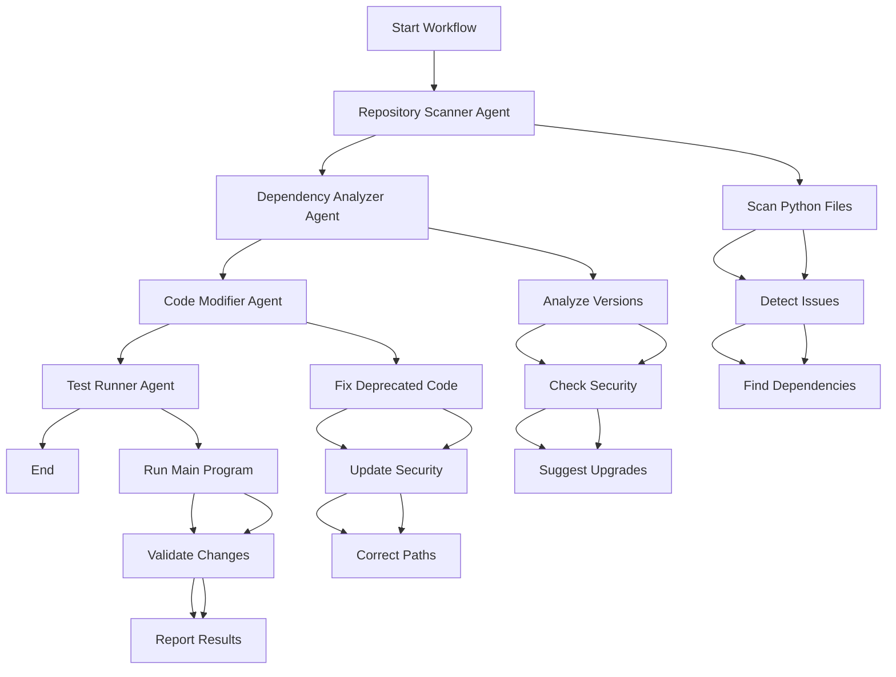

# LangGraph Dependency Upgrade Agent Architecture

## 🏗️ Multi-Agent Orchestration Flow



## 🔄 State Management

### AgentState Structure
```python
class AgentState(TypedDict):
    repository_path: str                    # Target repository
    current_issues: List[str]               # Detected problems
    dependencies_to_upgrade: Dict[str, str] # Package upgrades
    code_changes: List[str]                 # Applied fixes
    test_results: Dict[str, Any]           # Validation results
    messages: Annotated[List[str], add_messages] # Agent communications
```

## 🤖 Agent Responsibilities

### 1. Repository Scanner Agent
**Purpose**: Discover and catalog issues
- **Input**: Repository path
- **Actions**:
  - Scan all Python files recursively
  - Detect deprecated pandas methods (`fillna(method=...)`)
  - Find insecure requests (`verify=False`)
  - Identify path issues
  - Parse requirements.txt for versions
- **Output**: Issues list + dependencies dictionary

### 2. Dependency Analyzer Agent  
**Purpose**: Analyze and prioritize upgrades
- **Input**: Current dependencies
- **Actions**:
  - Check latest versions (simulated PyPI lookup)
  - Identify security vulnerabilities
  - Prioritize critical updates
  - Calculate upgrade impact
- **Output**: Upgrade recommendations with priorities

### 3. Code Modifier Agent
**Purpose**: Apply automated fixes
- **Input**: Issues list + code files
- **Actions**:
  - Replace deprecated pandas syntax
  - Fix security vulnerabilities
  - Correct file path references
  - Apply regex-based transformations
- **Output**: Modified files + change log

### 4. Test Runner Agent
**Purpose**: Validate all changes
- **Input**: Modified code
- **Actions**:
  - Execute main program
  - Capture output and errors
  - Validate functionality
  - Generate test report
- **Output**: Success/failure status + error details

## 🔗 LangGraph Workflow Definition

```python
def _build_workflow(self) -> StateGraph:
    workflow = StateGraph(AgentState)
    
    # Sequential agent execution
    workflow.add_node("scan", self.scanner.scan_repository)
    workflow.add_node("analyze", self.analyzer.analyze_dependencies) 
    workflow.add_node("modify", self.modifier.modify_code)
    workflow.add_node("test", self.tester.run_tests)
    
    # Linear flow with state passing
    workflow.set_entry_point("scan")
    workflow.add_edge("scan", "analyze")
    workflow.add_edge("analyze", "modify") 
    workflow.add_edge("modify", "test")
    workflow.add_edge("test", END)
    
    return workflow.compile()
```

## 📊 State Transitions

| Agent | Input State | Output State | Key Changes |
|-------|-------------|--------------|-------------|
| Scanner | `repository_path` | `current_issues`, `dependencies_to_upgrade` | Populates issue catalog |
| Analyzer | `dependencies_to_upgrade` | Enhanced `dependencies_to_upgrade` | Adds version recommendations |
| Modifier | `current_issues` | `code_changes` | Applies fixes to files |
| Tester | `code_changes` | `test_results` | Validates functionality |

## 🎯 Execution Flow

1. **Initialization**: Create initial state with repository path
2. **Sequential Processing**: Each agent processes and enhances the state
3. **State Persistence**: All changes tracked in shared state object
4. **Error Handling**: Agents capture and report errors in state
5. **Final Result**: Consolidated success/failure with detailed logs

## 🔍 LangSmith Observability

With LangSmith tracing enabled, you can observe:
- **Agent Execution Times**: How long each agent takes
- **State Transitions**: How data flows between agents
- **Decision Points**: Why specific fixes were applied
- **Error Tracking**: Where and why failures occur
- **Performance Metrics**: Overall workflow efficiency

## 🚀 Benefits of This Architecture

1. **Modularity**: Each agent has single responsibility
2. **Scalability**: Easy to add new agents or modify existing ones
3. **Observability**: Full tracing of agent interactions
4. **State Management**: Centralized data flow
5. **Error Isolation**: Failures contained within agents
6. **Testability**: Each agent can be tested independently